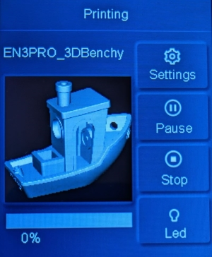
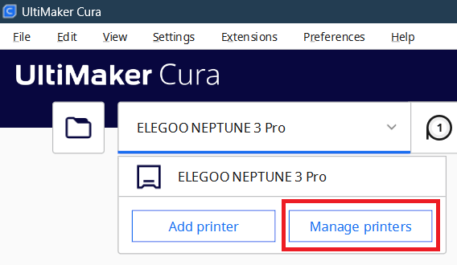
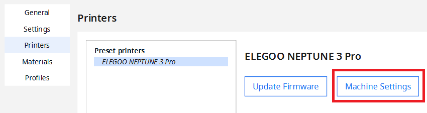
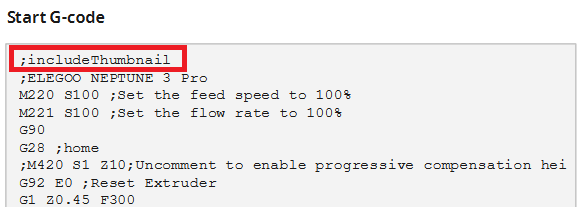

# ElegooN3Thumbnail &middot; 
Cura 5.x plugin for including thumbnail/preview images in gcode files for Elegoo Neptune 3 Pro, Plus and Max.

## Installation

- Download the latest relase [here](https://github.com/sigathi/ElegooN3Thumbnail/releases/latest/download/ElegooN3Thumbnail.curapackage).
- Drag the `.curapackage` file onto Cura and restart Cura.

## Usage
To enable the plugin, add `;includeThumbnail` to the Start G-code in your machine settings:
- Open printer selection menu and choose `Manage Printers`  

- Choose your Elegoo Neptune 3 Pro/Plus/Max printer  and then `Machine Settings`  

- At the top of `Start G-code` add `;includeThumbnail`.

## Contribution

This repository is based on [Toylerrr / ElegooNeptuneSnapshot ](https://github.com/Toylerrr/ElegooNeptuneSnapshot) and [daniel-kukiela / LotmaxxSnapshot](https://github.com/daniel-kukiela/LotmaxxSnapshot).
The image encoding binaries are exported from Elegoo Cura.
